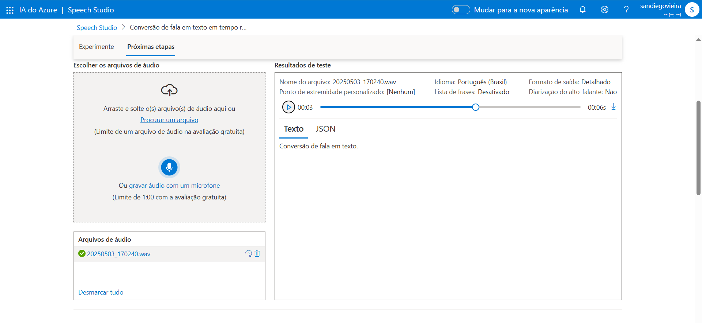
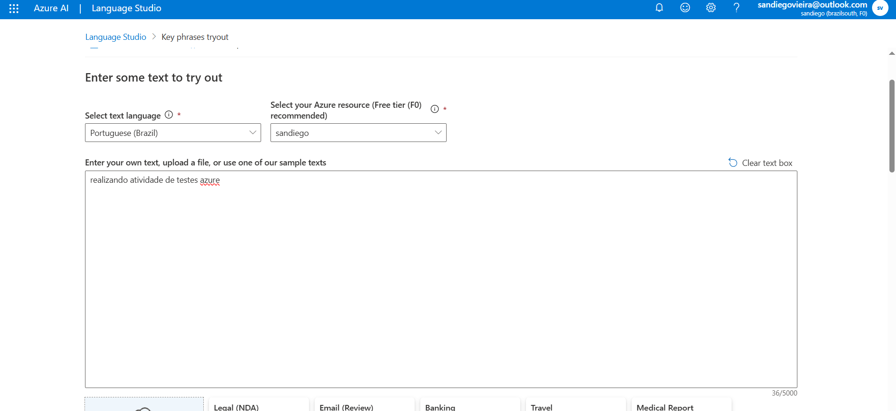

# 💡 Desafio DIO - Análise de Fala e Linguagem com Azure

Este repositório documenta minha participação no laboratório prático da **DIO (Digital Innovation One)**, focado em aplicar ferramentas de inteligência artificial da **Microsoft Azure** nas áreas de **fala** e **linguagem natural**.

## 🧠 Descrição do Desafio

O objetivo do laboratório foi praticar e aprofundar o uso das ferramentas **Azure Speech Studio** e **Language Studio**, aplicando conceitos como:

- Reconhecimento de fala com o **Speech Studio**
- Extração de informações e análise de texto com o **Language Studio**

## 🎯 Objetivos de Aprendizagem

- Aplicar conceitos de IA na prática utilizando serviços do Azure
- Documentar os processos técnicos de forma clara e organizada
- Utilizar o GitHub como repositório técnico e portfólio

## 🛠️ Ferramentas Utilizadas

- [Microsoft Azure Speech Studio](https://speech.microsoft.com/)
- [Microsoft Azure Language Studio](https://language.cognitive.azure.com/)
- Git e GitHub

## ✅ Atividades Realizadas

- ✅ Criação de recurso no Azure e uso do **Speech Studio** para conversão de fala em texto
- ✅ Testes práticos no **Language Studio** com:
  - Extração de frases-chave
  - Detecção de idioma
  - Análise de sentimento (se aplicável)
- ✅ Registro de cada etapa com capturas de tela

## 📸 Capturas de Tela

As imagens estão organizadas na pasta [`/images`](./images) contendo:

- Criação e uso do recurso no Speech Studio
- Teste de conversão de áudio para texto
- Testes com texto no Language Studio
- Resultados das extrações (frases-chave, idioma, etc.)

**Exemplo:**

| Speech Studio | Language Studio |
|---------------|-----------------|
|  |  |

## 📚 Recursos Oficiais

- [Explore Speech Studio - Microsoft Learn](https://learn.microsoft.com/en-us/training/modules/explore-speech-studio/)
- [Analyze text with Language Studio - Microsoft Learn](https://learn.microsoft.com/en-us/training/modules/analyze-text-with-language-studio/)
- [GitHub Markdown](https://guides.github.com/features/mastering-markdown/)

## 👨‍💻 Autor

**Sandiego Vieira de Oliveira**  
Desenvolvedor em formação pela DIO

  

